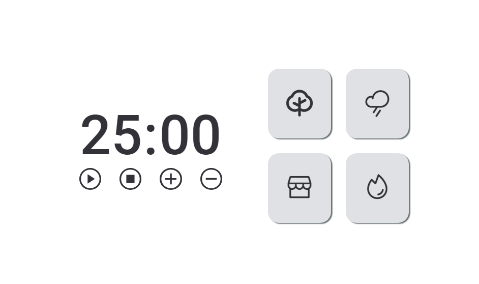

# Projeto Focus-Timer 2.0 do curso Explorer da Rocketseat

    
    
    

O Focus Timer 2.0 é um aplicativo de timer projetado para ajudar os usuários a manterem o foco e aumentar a produtividade. Além de contar o tempo, o aplicativo oferece a opção de personalizar sons ambientais para criar um ambiente propício para a concentração.

## :exclamation: Pré-requisitos

Navegador web moderno

## :hammer: Instalação

1. Clone o repositório: git clone https://github.com/Raissa-Cardoso/XR-Focus-Timer2.git
2. Abra o arquivo `index.html` em seu navegador web.

## :computer: Uso

Após abrir o arquivo `index.html` em seu navegador, você terá acesso ao site do Focus-Timer, onde pode utilizar o timer e alternar entre os modos de visualização.
1) Iniciar/Pausar o timer.
2) Zerar o timer.
3) Adicionar ou Subtrair cinco minutos ao timer.
4) Reproduzir sons ambientais para ajudar na concentração.

## :star: Tecnologias utilizadas

- **`HTML`**
- **`CSS`**
- **`Javascript`**
